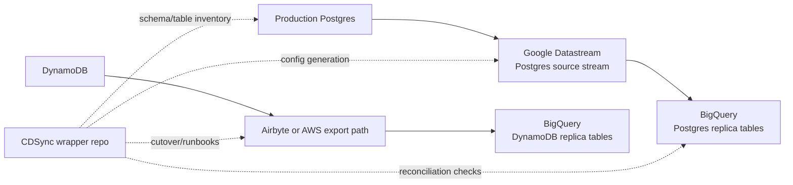

# CDSync Sunset: Datastream First, Airbyte Second

This is the replacement direction for production replication. CDSync should stop
being the primary CDC engine for high-volume production Postgres to BigQuery
replication.

## Decision

- Primary path for Postgres to BigQuery: Google Datastream.
- Secondary path for DynamoDB to BigQuery: evaluate Airbyte first, AWS
  DynamoDB export/incremental export to S3 second.
- CDSync role after migration: wrapper/control repo, validation harness,
  emergency bridge, and migration helper. It should not keep accumulating
  bespoke CDC broker semantics unless a replacement path fails a POC gate.

## Target Architecture

## Why Datastream First

Google Datastream is already the managed product shaped around the thing CDSync
kept becoming: source logical decoding, snapshots/backfills, direct BigQuery
replication, freshness monitoring, and operational guardrails.

Datastream also explicitly documents the key architectural lesson from the
fullstack incident: a single PostgreSQL stream uses a single replication slot,
so high-volume tables can create head-of-line blocking. The recommended shape is
to split high-write tables into separate streams.

The replacement is not magic. Datastream still uses PostgreSQL logical
replication slots, BigQuery CDC writes still have cost/freshness tradeoffs, and
source table primary-key/replica-identity shape matters. The point is that those
are product constraints we can design around instead of continuing to own a CDC
broker.

## What CDSync Should Still Do

CDSync can remain valuable as a repo and operational toolkit if it is narrowed:

1. Generate Datastream stream/table mapping config from existing CDSync config.
2. Validate source prerequisites: primary keys, publication/table coverage,
   replica identity, excluded tables, schema quirks.
3. Reconcile source counts and destination counts during migration.
4. Produce cutover dashboards/runbooks.
5. Run one-shot backfills only where Datastream/Airbyte cannot cover a table.
6. Keep current CDC code as a temporary bridge only, with production re-enable
   behind an explicit exception.

## Datastream POC Gates

Run this before any broad production migration:

1. Select representative tables:
   - one high-write hot table
   - one large historical table
   - one delete-heavy table
   - one schema-change-prone table
   - one normal table
2. Create separate Datastream streams for hot tables and normal tables.
3. Verify:
   - initial backfill completes
   - ongoing inserts/updates/deletes arrive in BigQuery
   - BigQuery table naming and metadata are acceptable
   - schema changes behave acceptably
   - source CPU/WAL impact stays within budget
   - freshness and lag alarms are usable
   - cost is acceptable
   - BigQuery CDC `max_staleness` is tuned to an acceptable cost/freshness point
   - primary-key and `REPLICA IDENTITY` edge cases are known before production
4. Run a 10x hot-table write burst in staging and verify only the hot stream
   lags, not the normal-table stream.

## DynamoDB POC Gates

Airbyte first:

1. Test DynamoDB source to BigQuery destination with one representative table.
2. Verify nested/object mapping, deletes if needed, incremental behavior,
   throughput, and cost.
3. Confirm whether Airbyte is acceptable operationally for this narrow use case.
4. Treat delete replication as a POC blocker if the target use case needs
   deleted DynamoDB rows to disappear or be tombstoned in BigQuery; the current
   Airbyte DynamoDB connector documents incremental append but not incremental
   delete replication.

AWS export fallback:

1. Use DynamoDB export or incremental export to S3.
2. Transfer/load to BigQuery on a schedule.
3. Prefer this when freshness measured in minutes/hours is acceptable.

## Cutover Shape

1. Keep CDSync off for fullstack production CDC while the Datastream POC runs.
2. Stand up Datastream into parallel BigQuery datasets/tables.
3. Compare row counts, primary-key samples, delete behavior, and freshness.
4. Freeze or replay the small cutover window if needed.
5. Point downstream analytics at Datastream-backed tables.
6. Decommission CDSync replication slots and production CDC tasks only after
   validation passes.

## References

- Google Datastream docs: https://cloud.google.com/datastream/docs
- Datastream PostgreSQL source docs:
  https://docs.cloud.google.com/datastream/docs/sources-postgresql
- Datastream BigQuery destination docs:
  https://cloud.google.com/datastream/docs/destination-bigquery
- Airbyte docs: https://docs.airbyte.com/
- Airbyte DynamoDB connector page:
  https://docs.airbyte.com/integrations/sources/dynamodb
- AWS DynamoDB export to S3:
  https://docs.aws.amazon.com/amazondynamodb/latest/developerguide/S3DataExport.HowItWorks.html
